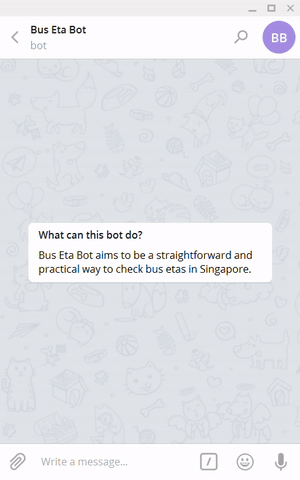
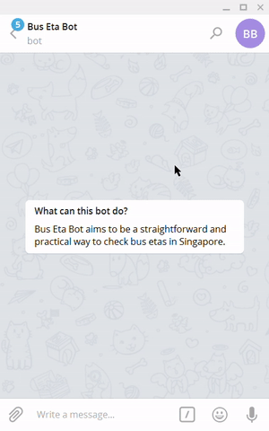

# Bus Eta Bot
A Telegram bot for checking bus etas in Singapore

### Check etas

### Search bus stops

## Getting started

Contact [@BusEtaBot](https://t.me/BusEtaBot/) on Telegram now!

## Features

[Changelog](CHANGELOG.md)

- Request etas for all buses or specific buses at a bus stop by id.
- Search all bus stops by id, description and road name via inline query.
- **(WIP)** Query bus stops by location.

## Architecture
Bus Eta Bot is deployed as a [Cloud Function](https://cloud.google.com/functions/) on [Google Cloud Platform](https://cloud.google.com/) responding to [Telegram Bot API](https://core.telegram.org/bots/api) webhooks.

## [Privacy Policy](PRIVACY.md)
