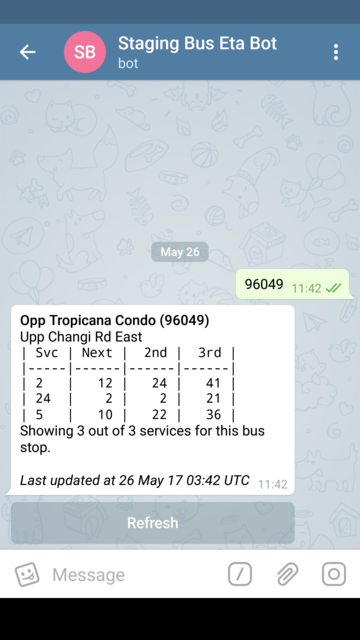
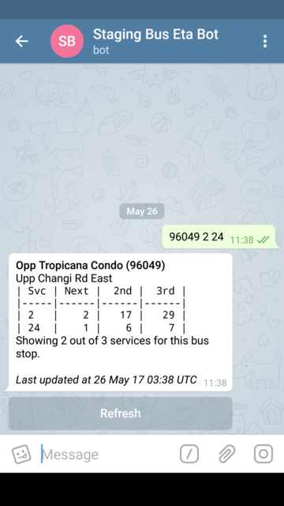
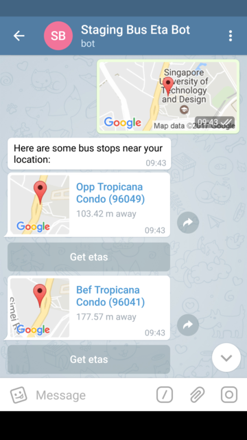
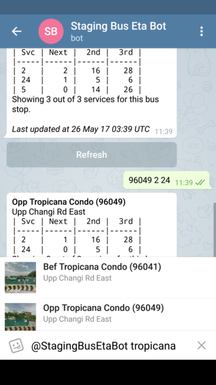
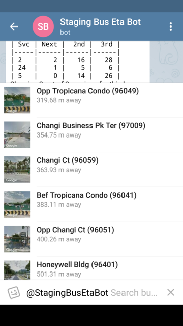
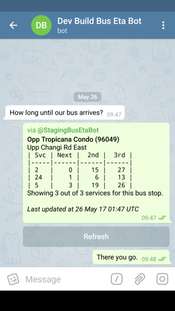

# Bus Eta Bot

A practical Telegram bot for getting bus etas in Singapore supporting refreshing, bus stop search and showing nearby bus stops.

## Getting started
Telegram: [@BusEtaBot](https://t.me/BusEtaBot)

## Features
### Get etas by bus stop code

### Get etas by bus stop code and service

### Send a location to get nearby bus stops

### Search bus stops by bus stop code, description or road name

### Get nearby bus stops

### Send etas as inline messages

